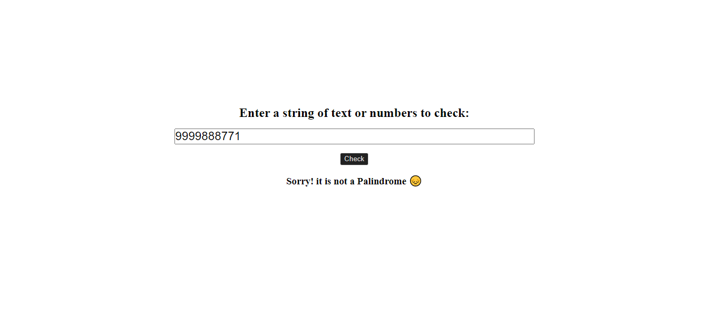

# PRANAV MATHUR

## 1. STOPWATCH

### Learnings from the project:

- Asynchronous callback functions like _setInterval_ and _clearInterval_

### Time taken:

    It took me 3 hours to complete this project.

### Screenshots:

---

## 2. PALINDROME

### Learnings from the project:

- Array and string functions like _split()_, _splice()_ _join()_ and _reverse()_

### Time taken:

    It took me an hour to complete this project.

### Screenshots:

---

## 3. FORM VALIDATION

### Learnings from the project:

- Some more JavaScript problem solving techniques

### Time taken:

    It took me 2 hours to complete this project.

### Screenshots:

---

## 4. COLOUR GAME

### Learnings from the project:

- Some more JavaScript problem solving techniques

### Time taken:

    It took me 4 hours to complete this project.

### Screenshots:

---

## 5. EXPENSE TRACKER

### Learnings from the project:

- Selecting DOM elements using their _attributes_
- Manipulating data and inputs according to selected radio buttons

### Time taken:

    It took me 5 hours to complete this project.

### Screenshots:

---

## Live link:

[Go to site](https://more-javascript-projects.netlify.app/)

